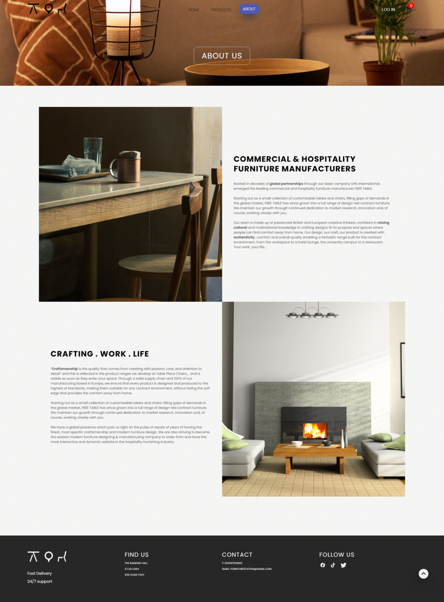

# FURNITURE STATION - An eCommerce Website

Furniture-station is a fully responsive ecommerce website, maximum compatiblities in all mobile devices, built using HTML, CSS, JavaScript and ReactJs.

## Demo




## Link Demo

Link Project: https://furniture-station.netlify.app/

## Prerequisites

Before you begin, ensure you have met the following requirements:

- [Git](https://git-scm.com/downloads "Download Git") must be installed on your operating system.

## Installing FURNITURE STATION

To install **FURNITURE STATION**, follow these steps:

Linux and macOS:

```bash
sudo git clone https://github.com/nguyencuong1608/furniture-app.git
```

Windows:

```bash
git clone https://github.com/nguyencuong1608/furniture-app.git
```

## Contact

If you want to contact me you can reach me at [Facebook](https://www.facebook.com/profile.php?id=100004068516734).
